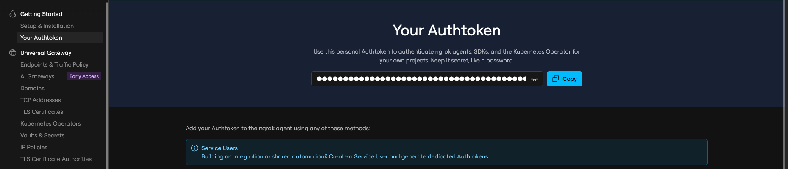

# ☁️ Cloud Portal

**Cloud Portal** is a lightweight desktop application, brough to you by **LVHP**, that instantly turns your PC into a publicly accessible web server — no technical knowledge required. Select a folder, enter your Ngrok auth token, and click **Start Server**. Within seconds, anyone with the link can access your files, stream movies, or browse your hosted content from anywhere in the world.

---

## 💬 Give LVHP a follow!

1. [Facebook](https://www.facebook.com/share/p/1FNsh8JyxH/)

---

## ✨ Features

- **One-click server setup** — Start and stop a web server with a single button click
- **Instant public URL** — Automatically creates a secure Ngrok tunnel so your server is accessible from outside your local network
- **Live console output** — Real-time log feed shows server status, tunnel URL, and any errors
- **Live server status indicator** — A color-coded dot shows whether your server is online or offline at a glance
- **Threaded architecture** — Server and tunnel operations run in background threads so the UI stays responsive
- **Graceful shutdown** — Properly tears down both the HTTP server and Ngrok tunnel when you stop

---

## 📸 Interface Overview

The application window is organized into these sections:

| Section                  | Description                                                         |
| ------------------------ | ------------------------------------------------------------------- |
| **Disclaimer banner**    | Reminds you to be cautious about who you share your public URL with |
| **Ngrok Auth Token**     | Masked input for your personal Ngrok authentication token           |
| **Directory selector**   | File picker to choose the folder you want to serve                  |
| **Server status**        | Live green/red indicator showing if the server is currently running |
| **Console**              | Scrollable log output with real-time server messages                |
| **Start / Stop buttons** | Color-coded action buttons (green = Start, red = Stop)              |

---

## 🚀 Getting Started

### Prerequisites

- Python 3.8+
- A free [Ngrok account](https://ngrok.com/) (for your auth token)
- Required Python packages (see [Installation](#installation))

### Installation

```bash
git clone https://github.com/your-username/cloud-portal.git
cd cloud-portal
pip install -r requirements.txt
```

**Required packages:**

```
dearpygui
pyngrok
```

Install them manually if needed:

```bash
pip install dearpygui pyngrok
```

### Running the App

```bash
python -m UI/Home.py
```

### Alternative

Only if you want to avoid the hassle of running the commands

1. Head to my releases page https://github.com/Jhaiy/Cloud-Portal/releases

2. Download the latest release.

3. Run the .exe program.

---

## 🔧 How to Use

1. **Get your Ngrok Auth Token**
   - Sign up for a free account at [ngrok.com](https://ngrok.com/)
   - Go to your dashboard and copy your auth token
     

2. **Enter your Ngrok Auth Token**
   - Paste it into the "Ngrok Auth Token" field in the app (it will be masked)

3. **Select a directory**
   - Click **"Select directory"** and browse to the folder you want to share
   - This can be a folder of files, movies, a website, or anything else

4. **Start the server**
   - Click the green **"Start Server"** button
   - Watch the console for output — within a few seconds you'll see both a local and a public URL

5. **Share your link**
   - The console will display something like:
     ```
     --- SERVER INFO ---
     Local:  http://localhost:7000
     Global: https://xxxx-xx-xx-xx.ngrok-free.app
     -------------------
     ```
   - Share the **Global** URL with anyone you want to give access to

6. **Stop the server**
   - Click the red **"Stop Server"** button when you're done
   - This disconnects the Ngrok tunnel and shuts down the HTTP server cleanly

---

## 📁 Project Structure

```
cloud-portal/
│
├── UI/
│   └── Home.py                    # Application entry point and DearPyGui UI
│   └── Theme.py                   # Custom themes: warning banner, button colors, fonts
│
└── Backend/
    ├── Init_Server.py             # Server lifecycle: start, stop, health checks, Ngrok tunnel
    └── styled_http_server.py      # Custom HTTP server with a dark-themed directory listing UI
```

---

## ⚙️ Technical Details

### HTTP Server (`styled_http_server.py`)

- Built on Python's built-in `ThreadingHTTPServer` and `SimpleHTTPRequestHandler`
- Overrides `list_directory()` to serve a fully custom dark-themed HTML page
- Files are displayed in a responsive CSS grid with emoji icons, file sizes, and folder navigation
- Serves on `0.0.0.0:7000` by default (accessible on all network interfaces)

### Tunnel (`Init_Server.py`)

- Uses [pyngrok](https://pyngrok.readthedocs.io/) to open an HTTP tunnel to your local port 7000
- Polls `socket.create_connection` and an HTTP probe every 100ms (up to 10 seconds) to confirm the server is ready before starting the tunnel
- Tunnel and server references are kept globally so they can be cleanly disconnected on stop

### UI (`main.py` + `UI/Theme.py`)

- Built with [DearPyGui](https://github.com/hoffstadt/DearPyGui), a fast GPU-accelerated GUI framework
- Log messages are passed via a `queue.Queue` and polled each frame to avoid cross-thread UI writes
- Server status is polled each frame via a socket check and updates the status indicator in real time

---

## ⚠️ Security Considerations

> **Important:** Your Ngrok public URL is accessible to anyone who has the link.

- Do **not** share your public URL publicly (e.g., on social media) unless you intend open access
- Do **not** serve sensitive or private files unless you understand the risk
- Ngrok free tier URLs are temporary and change each session — your link expires when you stop the server
- For persistent or authenticated access, consider upgrading to a paid Ngrok plan

---

## 🗺️ Roadmap / Future Ideas

- [ ] Custom port configuration
- [ ] Upload support (let remote users upload files to your server)
- [ ] Basic HTTP authentication (username/password protection)
- [ ] Custom server name / branding
- [ ] Auto-copy public URL to clipboard on start
- [ ] System tray minimization
- [ ] Dark/light theme toggle

---
